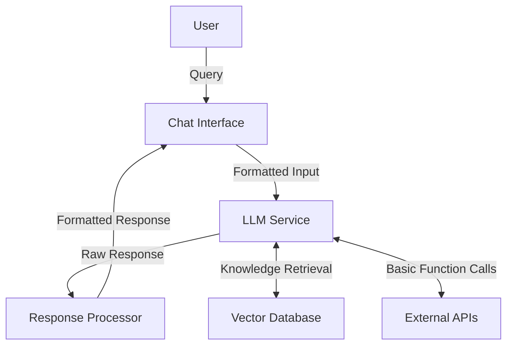
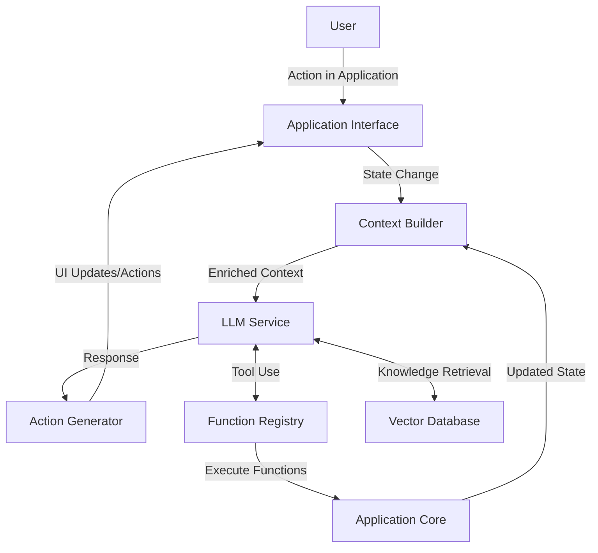

# LLM Application Architecture: Chatbots vs. Copilots

Large Language Models (LLMs) have transformed application development, enabling new types of AI-powered experiences. This document explains the fundamental architecture of LLM applications, with a detailed comparison of the two most common implementation patterns: chatbots and copilots.

## Core LLM Application Architecture

Regardless of the specific implementation, most LLM applications share a common architectural foundation:

### 1. Frontend Interface
- User interaction layer (web, mobile, CLI, voice, etc.)
- Manages conversation state and history
- Renders responses (text, components, visualizations)

### 2. Backend Processing
- API Gateway/Load Balancer
- Authentication and rate limiting
- Request handling and preprocessing

### 3. LLM Integration Layer
- Model access (API calls or local deployment)
- Prompt engineering and management
- Context window management

### 4. Augmentation Systems
- Vector databases for retrieval-augmented generation (RAG)
- Function calling capabilities
- Tool integration and orchestration

### 5. Operational Components
- Logging and monitoring
- User feedback collection
- Performance optimization

## Chatbots: Conversation-Oriented Architecture

Chatbots are designed primarily for conversational interaction, focusing on natural dialogue and information exchange.

### Architectural Characteristics

#### 1. Conversation-First Design
- Turn-based interaction model
- Maintains conversation history as context
- Optimized for multi-turn dialogue

#### 2. High-Level Integration
- Often integrated at application boundaries
- Typically serves as a standalone interface
- May function as an entire application by itself

#### 3. Prompt Engineering Focus
- Heavy emphasis on conversation design
- System prompts define personality and capabilities
- Careful management of context window limitations

#### 4. Implementation Patterns
- Session management for persistent conversations
- Memory mechanisms for long-term context
- Response templating and formatting

## Copilots: Task-Oriented Architecture

Copilots are designed to augment existing workflows, acting as assistants within established applications or processes.

### Architectural Characteristics

#### 1. Tool-First Design
- Integrated within existing application workflows
- Focuses on task completion rather than conversation
- Often has direct access to application functionality

#### 2. Deep Integration
- Embedded within application components
- Access to internal application state and context
- Ability to invoke application functions directly

#### 3. Function Calling Focus
- Structured output for programmatic use
- API-driven architecture for tool integration
- Emphasis on actionable outputs over conversation

#### 4. Implementation Patterns
- Tool libraries and function registries
- Planning and reasoning subsystems
- Workflow orchestration capabilities

## Key Architectural Differences

| Feature | Chatbots | Copilots |
|---------|----------|----------|
| **Primary Purpose** | Information exchange through conversation | Task assistance within applications |
| **Integration Depth** | Often standalone or surface-level | Deeply integrated with application internals |
| **User Interaction Model** | Conversational dialogue | Contextual suggestions and actions |
| **Context Sources** | Primarily conversation history | Application state + user activity + history |
| **Output Format** | Natural language responses | Mix of UI elements, actions, and text |
| **Autonomy Level** | Generally reactive to user queries | Can be proactive based on user context |
| **Application Awareness** | Limited to what's shared in conversation | Deep awareness of application state and capabilities |

## Implementation Comparison

### Chatbot Implementation

### Copilot Implementation

## Evolution Towards Unified Architectures

Modern LLM applications are increasingly blending characteristics from both chatbots and copilots:

1. **Agent Architectures**: Combining conversation abilities with function-calling to create autonomous assistants that can both converse and take actions.

2. **Multi-Modal Integration**: Incorporating image, audio, and video capabilities alongside text, creating richer interaction models.

3. **Context-Aware Systems**: Building applications that dynamically adjust their behavior based on user context, application state, and conversation history.

## Performance Considerations

### Latency Management
- Chatbots often optimize for response time to maintain conversation flow
- Copilots may prioritize quality over speed for complex tasks

### State Management
- Chatbots focus on conversation state preservation
- Copilots must maintain both conversation and application state

### Resource Utilization
- Chatbots typically have predictable resource needs
- Copilots may require dynamic scaling based on task complexity

## Security and Privacy Considerations

Both architectures face similar challenges:

1. **Data Exposure**: Careful management of what information is sent to the LLM
2. **Permission Boundaries**: Defining what actions the system can take
3. **Prompt Injection**: Protecting against malicious input manipulation

However, copilots typically face greater risks due to their deeper integration with application internals and greater access privileges.

## References

1. Bommasani, R., et al. (2022). "On the Opportunities and Risks of Foundation Models." Stanford Institute for Human-Centered Artificial Intelligence.

2. Wei, J., et al. (2023). "Chainof-Thought Prompting Elicits Reasoning in Large Language Models." Advances in Neural Information Processing Systems.

3. Chase, O. (2023). "LangChain: Building applications with LLMs through composability."

4. OpenAI. (2023). "Function Calling and other API Updates." OpenAI Blog.

5. Microsoft. (2023). "Copilot Architecture Best Practices." Microsoft Learn.

6. Anthropic. (2024). "Claude for Enterprise: Deployment Patterns." Anthropic Documentation.
