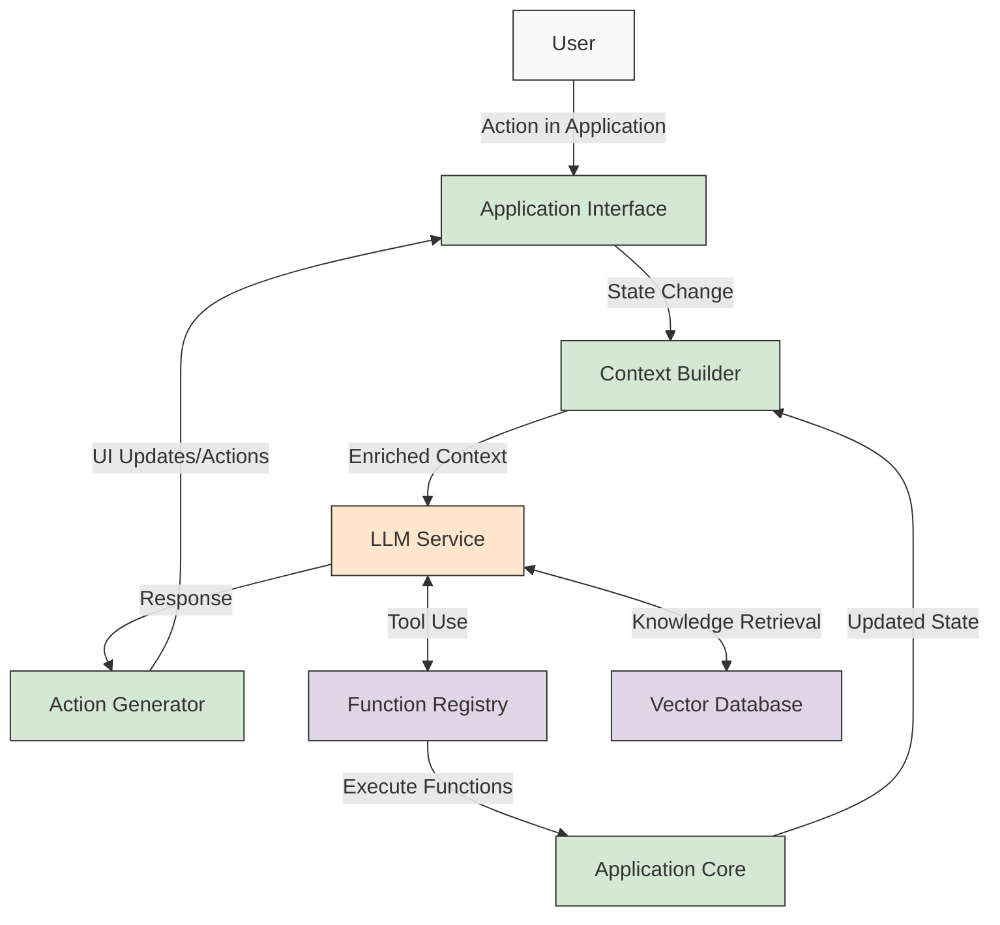

<div align="center">

# 🤖 LLM Application Architecture: Chatbots vs. Copilots

[](https://github.com/yourusername/llm-architecture)
[](https://github.com/yourusername/llm-architecture)

**A comprehensive analysis of architectural patterns for LLM-powered applications**

</div>

---

## 📋 Table of Contents

- [Introduction](#introduction)
- [Core Architecture](#-core-llm-application-architecture)
- [Chatbots](#-chatbots-conversation-oriented-architecture)
- [Copilots](#-copilots-task-oriented-architecture)
- [Architectural Differences](#️-key-architectural-differences)
- [Making the Right Choice](#-making-the-right-choice)
- [Implementation Comparison](#-implementation-comparison)
- [Evolution](#-evolution-towards-unified-architectures)
- [Performance Considerations](#-performance-considerations)
- [Security and Privacy](#-security-and-privacy-considerations)
- [Specialized Use Cases](#-specialized-use-cases)
- [Getting Started](#-getting-started-guide)
- [References](#-references)

---

## Introduction

The development of application systems has been revolutionized through Large Language Models (LLMs) which provide new opportunities for artificial intelligence-based experiences. The document describes the core structure of LLM applications and provides detailed analysis between chatbot and copilot implementation methods.

In today's landscape, you'll encounter these architectures everywhere – from ChatGPT and Claude (classic chatbots) to GitHub Copilot and Microsoft 365 Copilot (deeply integrated assistants). Understanding their architectural differences helps you make better decisions about which approach fits your specific needs.

---

## 🏗️ Core LLM Application Architecture

<div align="center">
  
</div>

Most LLM applications operate using a standard design structure which includes all implementations regardless of their specific version.

### 1. Frontend Interface

<div align="center">


</div>

- 🖥️ The frontend component provides interfaces through web and mobile applications as well as command line interfaces and voice platforms
- 💾 The component controls the state and historical data of the dialogue
- 📊 The application displays output through various formats including text and graphical components and visualizations

### 2. Backend Processing

- 🔄 The system includes an API Gateway/Load Balancer component
- 🔐 The system implements authentication protocols and maintains rate limits for users
- 🔍 The system handles incoming requests and performs preprocessing tasks

### 3. LLM Integration Layer

- 🧠 The system provides access to the model through API requests or by hosting it locally
- 📝 The system handles prompt development together with prompt administration
- 📦 Context window management

### 4. Augmentation Systems

- 📚 The system depends on vector databases for retrieval-augmented generation (RAG) along with the ability to call functions and tool management capabilities
- 🛠️ Function calling capabilities
- 🔗 Tool integration and orchestration

### 5. Operational Components

- 📊 The system maintains logging and monitoring features
- 👥 User feedback collection
- ⚡ Performance optimization

---

## 💬 Chatbots: Conversation-Oriented Architecture

<div align="center">
  
</div>

Chatbots exist to deliver conversational interactions which emphasize dialogue alongside information sharing.

### Architectural Characteristics

#### 1. Conversation-First Design

- 🔄 Turn-based interaction model
- 💾 The system preserves dialogue records to use as contextual information
- 🔁 Optimized for multi-turn dialogue

#### 2. High-Level Integration

- 🧩 The interface usually integrates at the level of application borders
- 🏢 The system functions as an interface which operates independently as a separate entity
- 🖥️ May function as an entire application by itself

#### 3. Prompt Engineering Focus

- 📝 The system puts strong emphasis on building conversation structures
- 🤖 System prompts define personality and capabilities
- 📦 Careful management of context window limitations

#### 4. Implementation Patterns

- 📂 The system needs to implement session management for maintaining ongoing dialogues between users
- 🧠 The system utilizes memory components to store information about long-term context
- 📋 The system uses response templates together with formatting protocols

### Real-World Examples

<div align="center">

| Product | Company | Key Features |
|:-------:|:--------|:-------------|
| ChatGPT | OpenAI | Standalone chat interface with web browsing and image capabilities |
| Claude | Anthropic | Conversation-focused assistant with comprehensive safety guardrails |
| Bard/Gemini | Google | Search-enhanced conversational interface |
| Customer Service Bots | Various | Domain-specific assistance for common customer queries |

</div>

#### Common Implementation Details

Most chatbot implementations store conversation state in one of several ways:
- **Token-based context window**: Keeping previous exchanges directly in the prompt (simple but limited by context window)
- **Vector database summaries**: Storing embeddings of conversation history with dynamic retrieval
- **Structured conversation memory**: Maintaining key facts, preferences, and goals in a structured database

For example, systems like ChatGPT maintain a hybrid approach – keeping recent messages in the context window while storing longer-term information about the user's preferences and previous important interactions.

---

## 🦾 Copilots: Task-Oriented Architecture

<div align="center">
  
</div>

The Copilot exists to assist existing workflows by providing support through established applications or processes.

### Architectural Characteristics

#### 1. Tool-First Design

- 🔧 The system operates within the current application workflows
- 🎯 The system prioritizes achieving tasks above maintaining a dialogue
- ⚙️ The system directly accesses the application functions

#### 2. Deep Integration

- 🧩 The system implements its components as part of application elements
- 📊 Internal application state and context remain accessible to the system
- 📲 The system performs direct function invocations of the application

#### 3. Function Calling Focus

- 📋 The system produces structured data which functions for programming tasks
- 🔌 The system operates through an API-based architecture which enables tool integration
- 🚀 The system focuses on producing actionable outputs instead of maintaining conversation capabilities

#### 4. Implementation Patterns

- 📚 Tool libraries and function registries
- 🧠 The system uses planning and reasoning components as part of its operation
- 🔄 Workflow orchestration capabilities

### Real-World Examples

<div align="center">

| Product | Company | Integration Type |
|:-------:|:--------|:-----------------|
| GitHub Copilot | GitHub/Microsoft | IDE integration with code context awareness |
| Microsoft 365 Copilot | Microsoft | Deep integration across Office applications |
| Duet AI | Google | Workspace-embedded assistance for documents and code |
| Adobe Firefly | Adobe | Creative application integration for generative design |

</div>

#### Implementation Approaches

Copilots typically integrate with host applications through:

- **IDE Extensions**: Like GitHub Copilot's VS Code integration, providing real-time suggestions based on your current code
- **API Hooks**: Systems that plug into existing software via officially supported API endpoints
- **Keyboard & UI Monitoring**: Some copilots access application context by observing UI elements and keyboard inputs
- **Custom SDKs**: Application vendors increasingly offer dedicated SDK packages to properly integrate LLM capabilities

For example, Microsoft 365 Copilot uses a combination of API access and specialized connectors to access your documents, emails, and other content while maintaining appropriate permissions boundaries.

---

## ⚖️ Key Architectural Differences

<div align="center">

| Feature | 💬 Chatbots | 🦾 Copilots |
|:-------:|:------------|:------------|
| **Primary Purpose** | Information exchange through conversation | Task assistance within applications |
| **Integration Depth** | Surface-level integration | Deeply integrated with application internals |
| **User Interaction Model** | Conversational dialogue | Contextual suggestions and actions |
| **Context Source** | Primarily conversation history | Application state + user activity + history |
| **Output Format** | Natural language responses | Mix of UI elements, actions, and text |
| **Autonomy Level** | Generally reactive to user queries | Can be proactive based on user context |
| **Application Awareness** | Limited to conversation content | Deep awareness of application state and capabilities |

</div>

## 🔄 Making the Right Choice

When deciding between chatbot and copilot architectures, consider these key factors:

<div align="center">


</div>

### Trade-offs to Consider

<div align="center">

| Factor | Chatbot Advantage | Copilot Advantage |
|:-------|:------------------|:------------------|
| **Development Speed** | Faster to market with simpler architecture | More valuable but requires deeper integration |
| **User Experience** | Better for broad Q&A and information tasks | Superior for in-context workflow assistance |
| **Maintenance** | Easier to update; less dependency on host apps | More powerful but updates tied to application changes |
| **Data Privacy** | Can function with limited access to user data | Requires deeper access to be truly useful |
| **Technical Debt** | Less integration code to maintain | More complex dependency management |

</div>

In my experience, chatbots make sense when you need a general-purpose assistant with minimal integration requirements. For example, a support bot that helps users troubleshoot issues or answers policy questions works well as a chatbot.

Copilots shine when users are working within specific applications and need contextual help with their tasks. If you're building something to help people write code, analyze spreadsheets, or draft documents, the copilot approach will deliver a much more magical experience, though at the cost of more complex development.

---

## 🔄 Implementation Comparison

### Chatbot Implementation

<div align="center">


</div>

### Copilot Implementation

<div align="center">



</div>

---

## 🔄 Evolution Towards Unified Architectures

<div align="center">
  
</div>

Modern LLM applications combine characteristics of both chatbots and copilots in their current implementations.

<div align="center">


</div>

1. **🤖 Agent Architectures**: The system unites conversation functions with function-calling mechanisms to develop self-operating assistants which perform both dialogue and execution tasks. For example, AutoGPT and BabyAGI represent early experiments in autonomous agents that can plan and execute multi-step tasks while maintaining dialogue capabilities.

2. **📡 Multi-Modal Integration**: The system includes image and audio and video processing in addition to text functions for developing more sophisticated interaction systems. Products like Midjourney Discord bot blend conversational interfaces with rich media generation.

3. **🔄 Adaptive Interaction**: The development of applications requires creating systems that modify their operational patterns through user contexts as well as application states and historical dialogues.

### Emerging Trends

#### Local Deployment Considerations

The push toward running LLMs locally is changing both architectures:

- **On-device chatbots**: Increasingly popular for privacy, offline use, and reduced cloud costs
- **Embedded copilots**: Code-specific tools like Continue and Cursor demonstrate how smaller, specialized models can provide copilot features locally

#### Hybrid Approaches

Many successful products now blend elements of both architectures:

- **Conversational interfaces with deep tool integration**: ChatGPT Plugins and Claude's tool use feature
- **Application-embedded chatbots**: Like Notion AI, which feels like a chatbot but has deep context awareness of your document

#### RAG vs. Fine-tuning Considerations

Different content strategies make sense for different architectures:

- **Chatbots**: Often benefit from RAG for breadth of knowledge
- **Copilots**: Frequently use domain-specific fine-tuning for deep understanding of application contexts
- **Hybrid systems**: Increasingly use a combination of both approaches

In my experience building these systems, the boundaries between chatbots and copilots continue to blur. The most successful implementations take the best elements of both: the natural conversation flow of chatbots with the contextual awareness and action capabilities of copilots.

---

## ⚡ Performance Considerations

### Latency Management

<div align="center">

| 💬 Chatbots | 🦾 Copilots |
|:------------|:------------|
| Focus on rapid responses to maintain conversation flow | Emphasis on accuracy over speed for complex operations |

</div>

### State Management

<div align="center">

| 💬 Chatbots | 🦾 Copilots |
|:------------|:------------|
| Focus on conversation state | Must manage both conversation and application state |

</div>

### Resource Utilization

<div align="center">

| 💬 Chatbots | 🦾 Copilots |
|:------------|:------------|
| Predictable resource usage patterns | Resource requirements scale with task complexity |

</div>

---

## 🔒 Security and Privacy Considerations

<div align="center">
  
</div>

Both architectures face similar challenges:

1. **🔓 Data Exposure**: The system needs proper controls for determining which data gets transmitted to the LLM.
2. **🚧 Permission Boundaries**: The system requires clear definitions for its authorized actions.
3. **🛡️ Prompt Injection**: The system needs protection mechanisms against harmful modifications of input data.

> ⚠️ The risks faced by copilots exceed those of chatbots because they operate within application internals and possess elevated access privileges.

---

## 📈 Specialized Use Cases

<div align="center">
  
</div>

Different domains have adapted these architectural patterns to meet their specific needs:

### Healthcare

<div align="center">

| Architecture | Applications | Key Considerations |
|:-------------|:-------------|:-------------------|
| **Chatbots** | Patient intake, medication reminders, symptom checkers | Privacy regulations (HIPAA), factual accuracy, clear limitations |
| **Copilots** | EHR assistants, radiology analysis support, clinical documentation | Medical licensing boundaries, explainability, integration with existing systems |

</div>

Healthcare implementations often employ stricter guardrails and higher accuracy thresholds. For example, a symptom checker chatbot might use a more conservative approach when suggesting possible diagnoses, while a clinical documentation copilot would need to integrate deeply with electronic health record systems and maintain strict version control.

### Finance

<div align="center">

| Architecture | Applications | Key Considerations |
|:-------------|:-------------|:-------------------|
| **Chatbots** | Customer service, general financial education, account inquiries | Compliance with financial regulations, clear disclosure of AI usage |
| **Copilots** | Investment analysis, fraud detection assistance, regulatory compliance | Auditability, traceability of recommendations, integration with proprietary data |

</div>

Financial institutions have been particularly interested in copilot architectures that can provide analyst augmentation while maintaining strong governance and explainability. For example, JPMorgan's IndexGPT combines conversational interfaces with deep integration into their financial data systems.

### Education

<div align="center">

| Architecture | Applications | Key Considerations |
|:-------------|:-------------|:-------------------|
| **Chatbots** | Student Q&A, concept explanations, language practice | Age-appropriate content filters, citation capabilities |
| **Copilots** | Essay feedback, code tutoring, personalized curriculum development | Integration with learning management systems, academic integrity |

</div>

Educational applications often blend both architectures. For instance, Khan Academy's Khanmigo functions primarily as a chatbot for student interaction, but includes copilot-like features when integrated with specific learning activities. The key challenge in educational contexts is balancing assistance with promoting genuine learning.

---

## 🚀 Getting Started Guide

<div align="center">
  
</div>

If you're looking to implement either of these architectures, here are practical first steps to get you moving in the right direction:

### Chatbot Implementation Checklist

1. **Define your scope**
   - What topics will your chatbot address?
   - How will you handle out-of-scope queries?
   - What personality should your chatbot exhibit?

2. **Choose your technology stack**
   - LLM selection: Consider OpenAI, Anthropic, open-source options like Llama
   - Vector database: Pinecone, Weaviate, Milvus, or Chroma for RAG capabilities
   - Development framework: LangChain, LlamaIndex, or custom implementation

3. **Design your conversational flow**
   - Create system prompts that define your bot's behavior
   - Implement memory mechanisms to maintain conversational context
   - Develop fallback strategies for when the bot can't help

4. **Start simple and iterate**
   ```python
   # Simple chatbot implementation using OpenAI (pseudocode)
   def chat(user_message, conversation_history):
       system_prompt = "You are a helpful assistant that..."
       
       # Combine history and new message
       context = conversation_history + user_message
       
       # Ensure we're within token limits
       if token_count(context) > MAX_TOKENS:
           context = summarize_and_prune(context)
       
       # Get response from LLM
       response = openai.chat.completions.create(
           model="gpt-4",
           messages=[
               {"role": "system", "content": system_prompt},
               {"role": "user", "content": context}
           ]
       )
       
       return response.choices[0].message.content
   ```

### Copilot Implementation Checklist

1. **Choose your integration points**
   - Which application(s) will your copilot enhance?
   - What specific workflows will benefit most from assistance?
   - What user actions should trigger the copilot?

2. **Design your context collection**
   - Identify what application state is relevant
   - Determine how to access this state (APIs, extensions, etc.)
   - Create structured context templates

3. **Develop your function calling approach**
   - Define the functions your copilot can call
   - Implement permission checks and validation
   - Create response handlers for each function

4. **Prototype with a simple integration**
   ```python
   # Example copilot for code completion (pseudocode)
   def suggest_code_completion(current_file, cursor_position, file_imports, project_context):
       # Build rich context
       relevant_docs = retrieve_similar_code(current_file, project_context)
       
       context = {
           "current_code": get_surrounding_code(current_file, cursor_position),
           "imports": file_imports,
           "project_patterns": extract_patterns(relevant_docs),
           "language": detect_language(current_file)
       }
       
       # Get suggestion from LLM
       completion = llm.complete(
           system_prompt="You are a coding assistant that helps complete code...",
           user_context=format_context(context),
           max_tokens=100
       )
       
       return format_as_suggestion(completion)
   ```

Remember, the best implementations start small and grow through iteration based on user feedback. Don't try to build the perfect system right away!

---

## 📚 References

<div align="center">
  
</div>

1. Bommasani, R., et al. (2022). ["On the Opportunities and Risks of Foundation Models."](https://crfm.stanford.edu/report.html) Stanford Institute for Human-Centered Artificial Intelligence.

2. Wei, J., et al. (2023). ["Chain of Thought Prompting Elicits Reasoning in Large Language Models."](https://arxiv.org/abs/2201.11903) Advances in Neural Information Processing Systems.

3. Chase, O. (2023). ["LangChain: Building applications with LLMs through composability."](https://github.com/langchain-ai/langchain)

4. OpenAI. (2023). ["Function Calling and other API Updates."](https://openai.com/blog/function-calling-and-other-api-updates) OpenAI Blog.

5. Microsoft. (2023). ["Copilot Architecture Best Practices."](https://learn.microsoft.com/en-us/microsoft-365-copilot/architecture) Microsoft Learn.

6. Anthropic. (2024). ["Claude for Enterprise: Deployment Patterns."](https://docs.anthropic.com/claude/docs/enterprise-deployment-patterns) Anthropic Documentation.

7. Touvron, H., et al. (2023). ["LLaMA: Open and Efficient Foundation Language Models."](https://arxiv.org/abs/2302.13971) Meta AI Research.

8. Rogers, A., et al. (2024). ["A Survey of LLM Deployment Architectures."](https://arxiv.org/abs/2402.05134) arXiv preprint.

9. Xu, Y., et al. (2023). ["Retrieval-Augmented Generation for Large Language Models: A Survey."](https://arxiv.org/abs/2312.10997) arXiv preprint.

10. Wang, P., et al. (2024). ["Augmenting LLMs with Memory: Architectures, Capabilities and Challenges."](https://arxiv.org/abs/2310.03053) arXiv preprint.

---

<div align="center">
  <a href="#-llm-application-architecture-chatbots-vs-copilots">⬆️ Back to top ⬆️</a>
  
  
</div>
